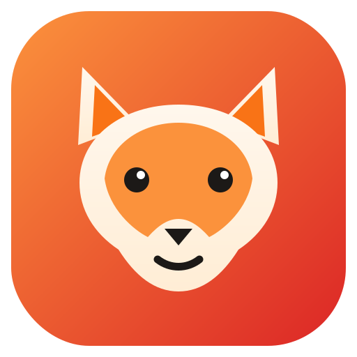
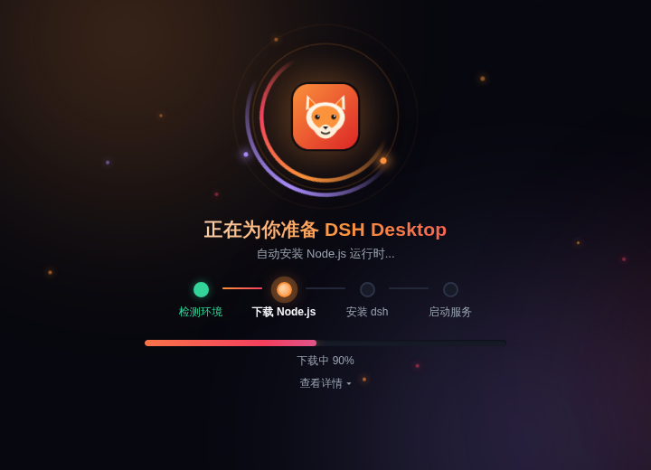
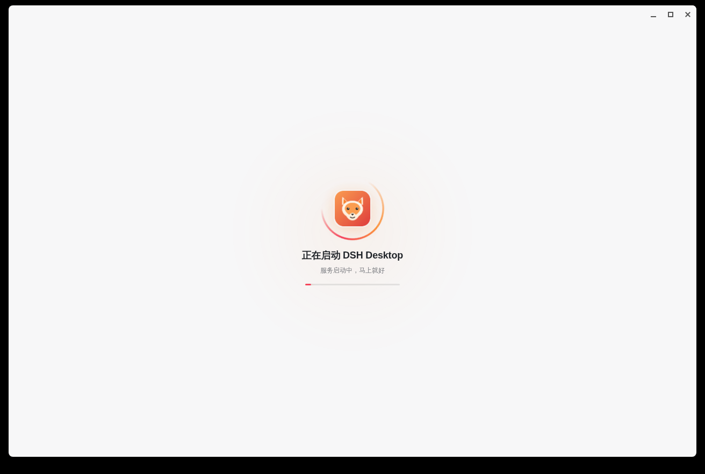
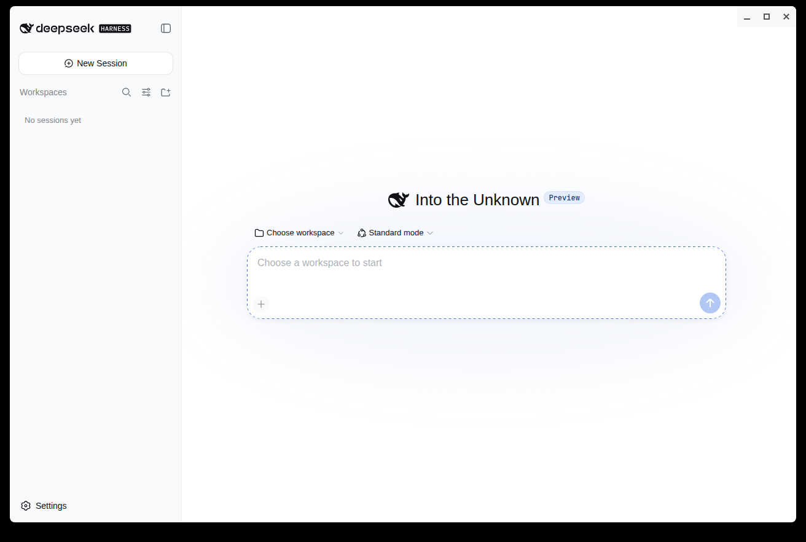
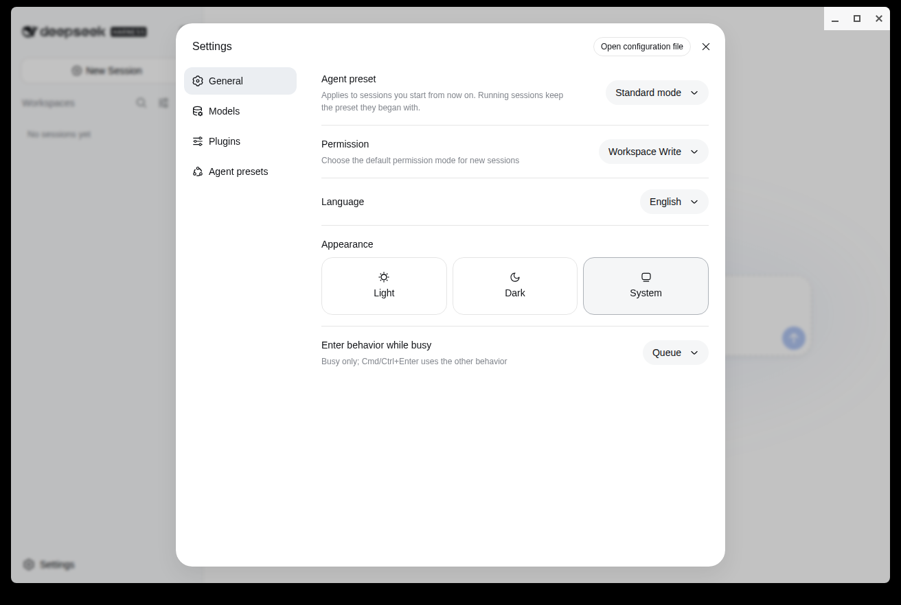
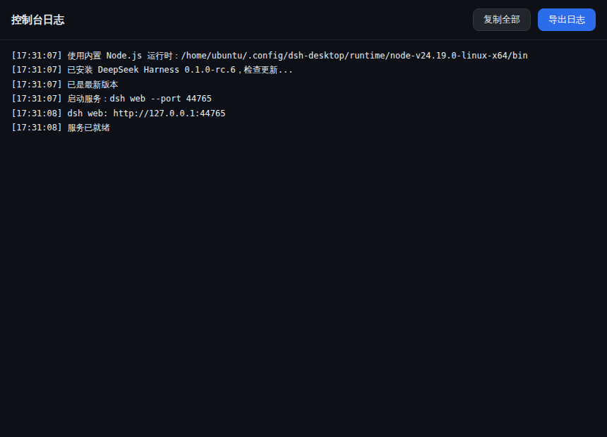

<p align="center">
  
</p>

<h1 align="center">DSH Desktop</h1>

<p align="center"><b>中文</b> | <a href="README.en.md">English</a></p>

[DeepSeek Harness (dsh)](https://github.com/deepseek-ai/deepseek-harness) 的非官方桌面版，支持 macOS / Windows / Linux。

这是一个适合不会编程的小朋友的**一键安装使用版本**：不需要命令行、不需要自己装 Node.js，下载安装包双击打开，应用会自动完成全部环境配置并直接进入界面。

> **来源与技术说明**：应用通过 npm 安装官方公开发布的 [`@deepseek-ai/dsh`](https://github.com/deepseek-ai/deepseek-harness)（官方使用方式为 `npx @deepseek-ai/dsh web`），通过 **Electron + electron-builder** 打包为桌面应用，内嵌官方 `dsh web` 服务的 Web UI，未复制或修改官方源码。

## 界面预览

首次启动自动安装（检测环境 → 下载 Node.js → 安装 dsh → 启动服务），全程炫彩安装动画：极光背景、浮动粒子、旋转光环、步骤连接线与流光进度条：



之后每次启动跳过安装页，只有一个轻量启动 splash（跟随系统深浅色主题），服务就绪即进入主界面：



内嵌 Web UI，无标题栏/菜单栏，沉浸式窗口：



设置（开机自启、最小化到托盘、自动更新、检查并更新 dsh、重启服务、打开数据目录、查看日志）：



控制台日志（实时查看、复制、导出）：



## 功能

- **首次启动自动配置环境**：自动检测系统 Node.js（需要 22.19+ 或 24+）；没有的话优先使用**安装包内置的 Node.js 运行时**（无需联网下载，弱网/离线环境也能安装成功），再不行才自动下载；然后自动安装 `@deepseek-ai/dsh`，全程炫彩安装动画与分步进度展示（并支持系统「减弱动态效果」设置）。
- **已安装秒进主界面**：环境配置只在首次启动进行，之后启动不再显示安装页，只有轻量启动 splash，服务就绪直接进入主窗口。
- **原创狐狸图标**：应用图标与托盘图标为原创绘制的小狐狸形象，无第三方品牌侵权风险。
- **内嵌 Web UI**：自动启动 `dsh web` 服务并内嵌在应用窗口中。
- **无干扰界面**：主窗口无标题栏、无菜单栏/工具条（沉浸式窗口，保留原生窗口控制按钮），并记住窗口大小、位置、最大化状态和缩放级别（Ctrl/Cmd 加减号缩放、0 还原）；窗口背景跟随系统深浅色主题，加载时不白闪。
- **稳定可靠**：单实例运行（重复打开会唤起已有窗口）；`dsh web` 服务意外退出时自动重启恢复；启动失败可一键重试或查看日志；快捷键 Ctrl/Cmd+Shift+R 重启服务、Ctrl/Cmd+U 检查 dsh 更新。
- **系统托盘**：关闭窗口可最小化到托盘继续运行（首次会有系统通知提示），托盘菜单支持显示窗口、设置、检查更新、打开终端（已预置 node 与 dsh 环境）、在浏览器中打开和退出。
- **系统设置**：开机自动启动、关闭窗口时最小化到托盘、启动时自动更新 dsh，均可在设置窗口中开关；可一键打开数据目录。
- **控制台日志**：设置或托盘菜单可打开日志窗口，实时查看应用与 dsh 服务运行日志，支持一键复制和导出；日志同时写入数据目录下的 `dsh-desktop.log` 文件。
- **重启服务**：设置或托盘菜单一键重启内置 dsh 服务，无需重启应用。
- **更新**：手动点击「立即检查并更新 dsh」后台执行安装并自动重启服务；开启自动更新后每次启动自动升级 `@deepseek-ai/dsh`；应用本身通过 GitHub Releases 自动更新（启动后延迟错峰检查、每 6 小时一次，系统从睡眠唤醒后也会补检）。
- **安全加固**：服务仅监听本机随机端口；渲染进程禁用 Node 集成并启用上下文隔离；外部链接一律在系统浏览器中打开。

## 下载安装

从 [Releases](https://github.com/gatesenman/dsh-desktop/releases) 下载对应平台的安装包：

| 平台 | 安装包 |
| --- | --- |
| macOS | `.dmg`（x64 / arm64） |
| Windows | `.exe`（NSIS 安装程序） |
| Linux | `.AppImage` / `.deb` |

## 从源码运行与打包

```sh
npm install
npm start        # 从源码运行
npm run dist     # 打包当前平台安装包
```

推送 `v*` 标签会触发 GitHub Actions 在三个平台上构建并发布 Release。

## 数据目录

Node.js 运行时、dsh 安装目录、日志和状态文件保存在应用用户数据目录（macOS: `~/Library/Application Support/dsh-desktop`，Windows: `%APPDATA%/dsh-desktop`，Linux: `~/.config/dsh-desktop`）。

## 许可证

MIT
