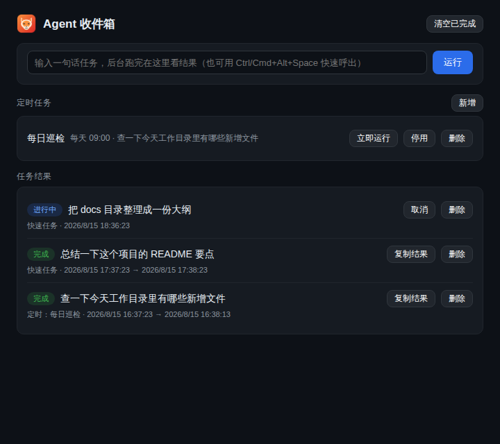
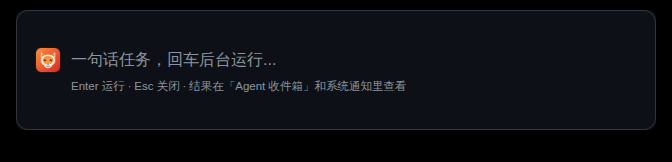

<p align="center">
  
</p>

<h1 align="center">DSH Desktop</h1>

<p align="center">
  <a href="https://github.com/deepseek-ai/deepseek-harness">DeepSeek Harness (dsh)</a> 的非官方桌面客户端 · macOS / Windows / Linux
</p>

<p align="center">
  <a href="https://github.com/gatesenman/dsh-desktop/releases/latest"></a>
  <a href="https://github.com/gatesenman/dsh-desktop/releases"></a>
  <a href="LICENSE"></a>
</p>

<p align="center"><b>中文</b> | <a href="README.en.md">English</a></p>

---

DSH Desktop 将官方发布的 [`@deepseek-ai/dsh`](https://github.com/deepseek-ai/deepseek-harness) 打包为开箱即用的桌面应用：**无需命令行、无需自行安装 Node.js**，下载安装包双击打开，应用自动完成全部环境配置并直接进入界面。

> **技术说明**：应用通过 npm 安装官方公开发布的 `@deepseek-ai/dsh`（官方使用方式为 `npx @deepseek-ai/dsh web`），使用 Electron + electron-builder 打包，内嵌官方 `dsh web` 服务的 Web UI。**未复制或修改任何官方源码**，桌面壳只提供运维、托盘、备份、诊断等外围增强，不改动 Harness 内部的 Agent、会话、插件与权限体系。

## 下载安装

从 [Releases](https://github.com/gatesenman/dsh-desktop/releases) 下载对应平台的安装包：

| 平台 | 安装包 | 说明 |
| --- | --- | --- |
| macOS | `.dmg` | x64 / Apple Silicon (arm64) |
| Windows | `.exe` | NSIS 安装程序 |
| Linux | `.AppImage` / `.deb` | x64 |

安装包内置 Node.js 运行时，弱网 / 离线环境同样可完成首次安装。

## 核心特性

### 零门槛安装与启动

- **首启自动配置**：检测系统 Node.js（22.19+ / 24+）→ 优先使用安装包内置运行时 → 必要时自动下载；随后自动安装 `@deepseek-ai/dsh` 并启动服务，全程分步安装动画（支持系统「减弱动态效果」）。
- **二次启动秒进**：环境配置仅首启执行一次，之后仅显示轻量启动 splash，服务就绪即进入主界面。
- **单实例 + 崩溃自愈**：重复打开唤起已有窗口；`dsh web` 服务意外退出自动重启；启动失败可一键重试或查看日志。

### Agent 收件箱与定时任务

- **全局快捷键快速任务**：任意界面按 `Ctrl/Cmd+Alt+Space` 呼出输入框，输入一句话任务回车，任务通过 dsh 官方 headless 模式在后台运行，完成或失败即发送系统通知。
- **Agent 收件箱**：集中查看全部后台任务的状态与结果，支持取消进行中任务、复制结果、删除与清空；点击系统通知直达收件箱。
- **定时任务**：创建「每天 HH:MM」或「每隔 N 小时」自动执行的任务（如每天 9 点总结昨天的工作目录变化），可随时启停、立即运行或删除。
- 后台任务需要已配置模型 API 凭据（在内嵌 Web UI 的 Models 页面配置即可）。

### 可靠运维

- **dsh 版本钉扎与一键回滚**：每个版本独立目录安装；升级先在新目录安装并通过 `dsh --version` 预检后才切换；保留上一版本，升级后启动失败自动回退，托盘 / 设置可随时手动回滚。
- **一键备份 / 恢复**：将 DSH 数据目录（会话、设置、凭据）与桌面偏好打包为单个 `tar.gz`；恢复前二次确认并校验归档路径安全，完成后自动重启服务。备份包含 API 凭据，请妥善保管。
- **环境体检 Doctor**：一键生成诊断报告（应用 / 系统 / Node / dsh 版本、服务与端口状态、数据目录读写、磁盘剩余、代理与 npm / DeepSeek API 网络连通性），可直接复制用于排障；不含 API key 等敏感值，不上传任何数据。
- **更新策略**：手动或自动更新 dsh；应用本身通过 GitHub Releases 自动更新（启动后延迟错峰检查、每 6 小时一次、睡眠唤醒后补检）。

### 桌面体验

- **沉浸式窗口**：无标题栏 / 菜单栏，记住窗口大小、位置、最大化状态与缩放级别；背景跟随系统深浅色主题，加载不白闪。
- **系统托盘**：最小化到托盘持续运行；托盘菜单涵盖 Agent 收件箱、快速任务、工作目录切换、设置、更新、回滚、体检、备份 / 恢复、打开终端（node 与 dsh 已预置 PATH）等。
- **工作目录切换**：任选文件夹作为 dsh 服务工作目录，记住最近目录，可一键恢复默认。
- **安全加固**：服务仅监听本机随机端口；渲染进程禁用 Node 集成并启用上下文隔离；外部链接一律在系统浏览器中打开。
- **原创视觉**：应用与托盘图标为原创绘制的小狐狸形象，无第三方品牌侵权风险。

## 界面预览

**首次启动安装动画**（检测环境 → 准备 Node.js → 安装 dsh → 启动服务）：


**二次启动轻量 splash**（跟随系统深浅色主题）：


**主窗口**（内嵌官方 Web UI，沉浸式无边框）：


**Agent 收件箱**（后台任务结果、定时任务管理）：



**快速任务**（全局快捷键 `Ctrl/Cmd+Alt+Space` 呼出）：



**设置**（开机自启、托盘、更新、维护工具）：


**控制台日志**（实时查看、复制、导出）：


## 快捷键

| 快捷键 | 功能 |
| --- | --- |
| `Ctrl/Cmd+Alt+Space` | 全局呼出快速任务输入框 |
| `Ctrl/Cmd+Shift+R` | 重启 dsh 服务 |
| `Ctrl/Cmd+U` | 检查并更新 dsh |
| `Ctrl/Cmd` `+` / `-` / `0` | 缩放界面 / 还原 |

## 从源码运行与构建

```sh
npm install
npm start        # 从源码运行
npm run dist     # 构建当前平台安装包
```

推送 `v*` 标签会触发 GitHub Actions 在 macOS / Windows / Linux 三平台构建并发布 Release。

## 数据目录

Node.js 运行时、dsh 版本化安装目录、任务记录、日志与状态文件保存在应用用户数据目录：

| 平台 | 路径 |
| --- | --- |
| macOS | `~/Library/Application Support/dsh-desktop` |
| Windows | `%APPDATA%/dsh-desktop` |
| Linux | `~/.config/dsh-desktop` |

## 许可证

[MIT](LICENSE)
